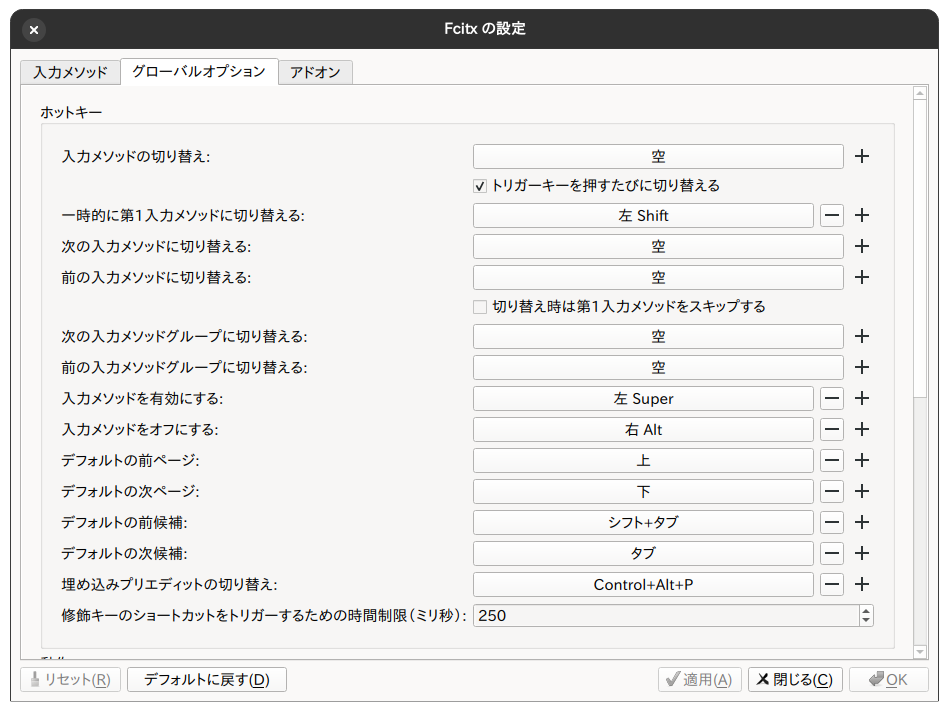

# setup opensuse

## dir

```bash
LANG=C xdg-user-dirs-gtk-update
```

## ui

- enable dark mode
- GNOME 設定のアクセシビリティ → Seeing → 「Cursor Size」を大きい奴にする

```bash
gsettings set org.gnome.desktop.wm.preferences button-layout 'close,appmenu:'
```

## font

1. download [plemoljp](https://github.com/yuru7/PlemolJP)
   - move `~/.local/share/fonts`
   - reboot
1. open tweaks > font
1. scale 1.5

- interface
  - ipa ui gothic
- document
  - ipa ex gothic
- mono
  - PlemolJP Console

## trackpad and mouse

- select normal

## keyboard

### input method

```bash
sudo zypper in fcitx5-mozc
sudo zypper rm ibus
```

1. open fcitx5 config
1. configure input method
   1. mozc
   1. english
1. configure global option
   
4. open tweaks
5. add startup application

### ime

1. open settings
1. select keyboard
1. add input source
1. remove english (intl)

### mozc

1. open mozc
1. select kotoeri

### keyd

1. `gsettings set org.gnome.mutter overlay-key ''`
1. remove shortcut
   - super + a
   - super + c
   - super + v
   - super + l
1. edit shortcut to show activity(super + space)
1. edit shortcut to show app list(super + shift + space)

## develop

### init

```bash
curl https://raw.githubusercontent.com/totto2727-dotfiles/dotfiles/refs/heads/main/opensuse-private/init.bash
reboot
deno run -A https://raw.githubusercontent.com/totto2727-dotfiles/dotfiles/refs/heads/main/opensuse-private/install.ts
```

### 1password

1. enable ssh agent
1. edit agent.toml

```toml:~/.config/1Password/ssh/agent.toml
[[ssh-keys]]
item = "opensuse-private"
vault = "Private"
```

1. reboot

### tailscale

```bash
sudo systemctl enable --now tailscaled
sudo tailscale up
```

## remove unnecessary app

1. open software
1. open repository setting
1. enable opensuse repository
1. remove apps
